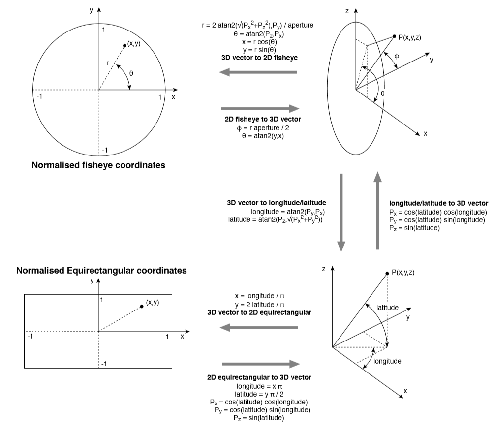

# Fisheye Projection 

**Coordinate mappings** 



[image source](http://paulbourke.net/dome/dualfish2sphere/) 


**Our shader algorithm**

```glsl
 fixed4 frag (v2f i) : SV_Target
 {
     float phi = i.uv[0] * 2.0 * UNITY_PI;
     float sf = 180.0 / _KAngle;
                
     float r = (i.uv[1]) * sf;
     float2 fisheye_uv = float2(cos(phi), sin(phi)) * r;

     float2 new_uv = (fisheye_uv + float2(1.0, 1.0)) * 0.5;
               
     // clip
     float intex = step(0.0, new_uv[0]) * step(new_uv[0], 1.0) * step(0.0, new_uv[1]) * step(new_uv[1], 1.0);

     float4 col = tex2D(_MainTex, new_uv) * intex;
     col = col * (tex2D(_AlphaTex, new_uv).a); /* Our alpha mask */

      // apply fog
      UNITY_APPLY_FOG(i.fogCoord, col);               
      return col;
 }

```


#### Notes 

* The shader algorithm is a version of the **3D vector to 2D fisheye** transformation. It operates on each sphere texture coordinate and finds the corresponding pixel in the fisheye frame.

* UV coordinates are normalized [0,1] with the origin at the **bottom left**.
* The variable `_KAngle` is a parameter that is passed in to the shader. By default it is 104. Changing this changes the radius of the projection, causing a zoom-like effect. Corresponds to 'aperture' in the mapping diagram


#### Links

[Fisheye conversions](http://paulbourke.net/dome/fish2/) 

[More from same site](http://paulbourke.net/dome/) <-- Nearly all searches on fisheye warping etc lead to his articles

[Unity project with original pixpro shader](https://github.com/yokamots/PixPro4kRealtime)